<!-- ============================= BANNER ============================= -->

<p align="center">
  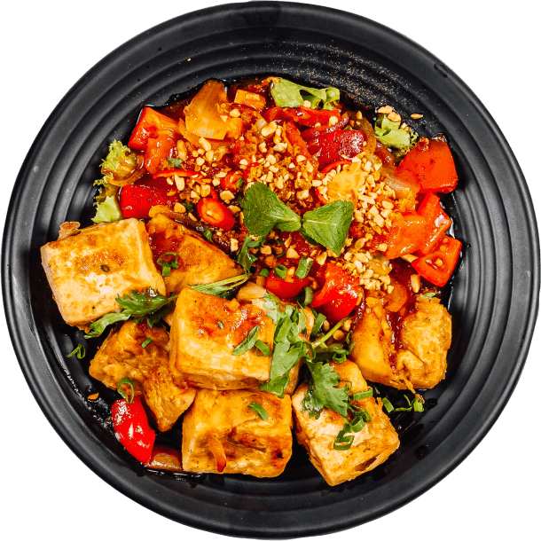
</p>

<h1 align="center">🍽️ Foodie.com</h1>

<p align="center">
  <b>A responsive full-stack food ordering &amp; restaurant reservation website.</b><br>
  Browse the menu, add dishes to your cart, book a table, and pay online — all in one place.
</p>

<p align="center">
  
  
  
  
  
  
</p>

<p align="center">
  
  
  
</p>

---

<h2 align="center">🖼️ Preview</h2>

<p align="center">
  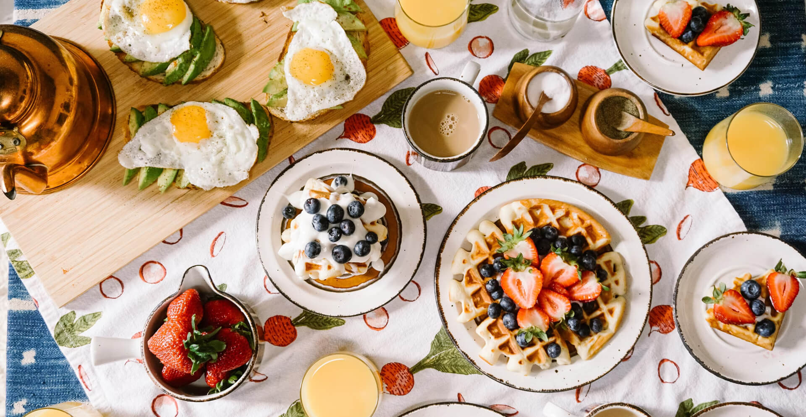
</p>

<!-- ========================= MENU HIGHLIGHTS ======================== -->

<h3 align="center">🍛 Menu Highlights</h3>

<table align="center">
  <tr>
    <td align="center">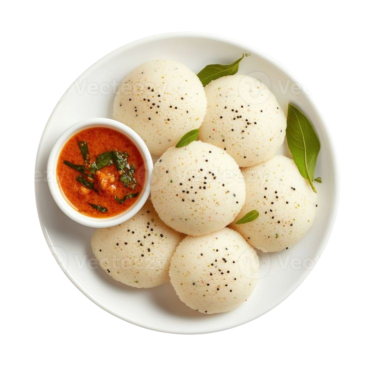<br><sub><b>Idli / Sambar</b></sub></td>
    <td align="center"><br><sub><b>Pav Bhaji</b></sub></td>
    <td align="center"><br><sub><b>Masala Dosa</b></sub></td>
    <td align="center"><br><sub><b>Chicken Biryani</b></sub></td>
  </tr>
  <tr>
    <td align="center">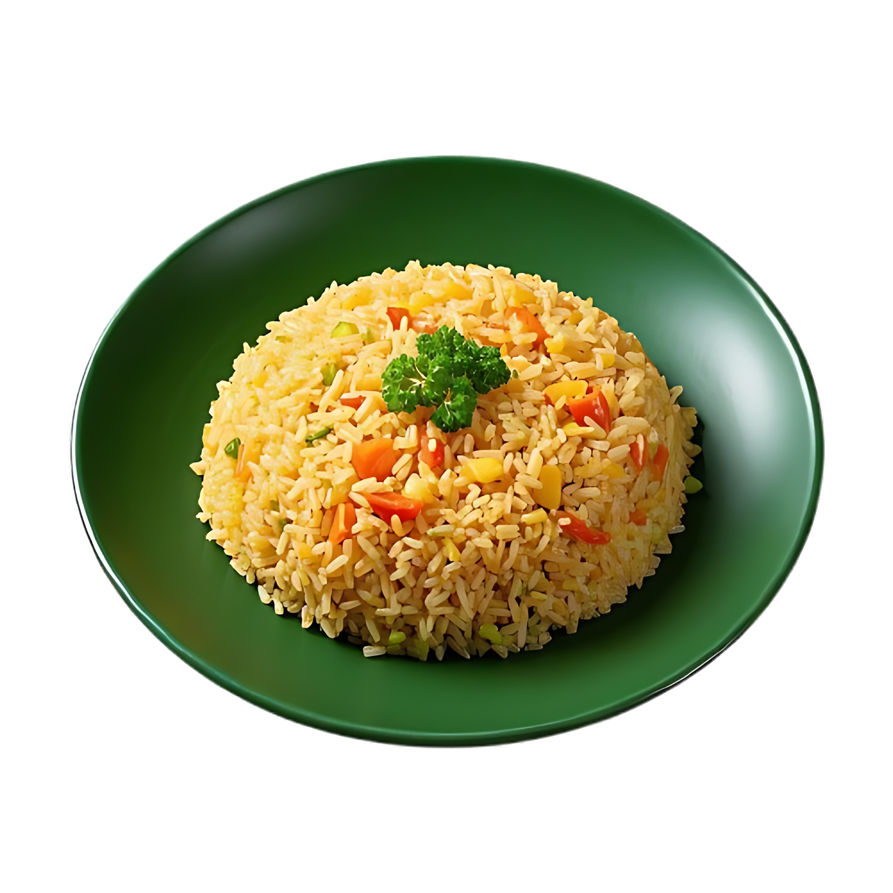<br><sub><b>Fried Rice</b></sub></td>
    <td align="center">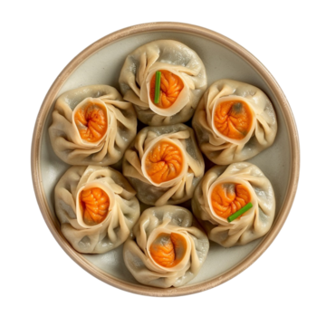<br><sub><b>Steamed Momo</b></sub></td>
    <td align="center">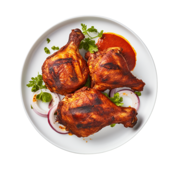<br><sub><b>Tandoori Chicken</b></sub></td>
    <td align="center"><br><sub><b>Chocolate Brownie</b></sub></td>
  </tr>
</table>

<!-- ============================ GALLERY ============================= -->

<h3 align="center">📸 Gallery</h3>

<table align="center">
  <tr>
    <td align="center"></td>
    <td align="center">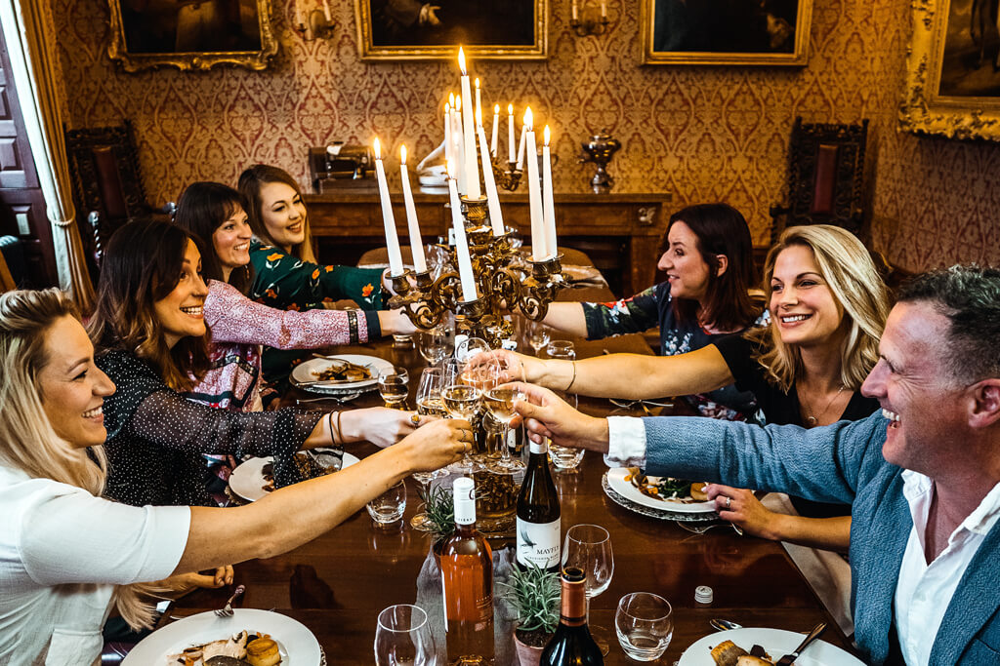</td>
    <td align="center">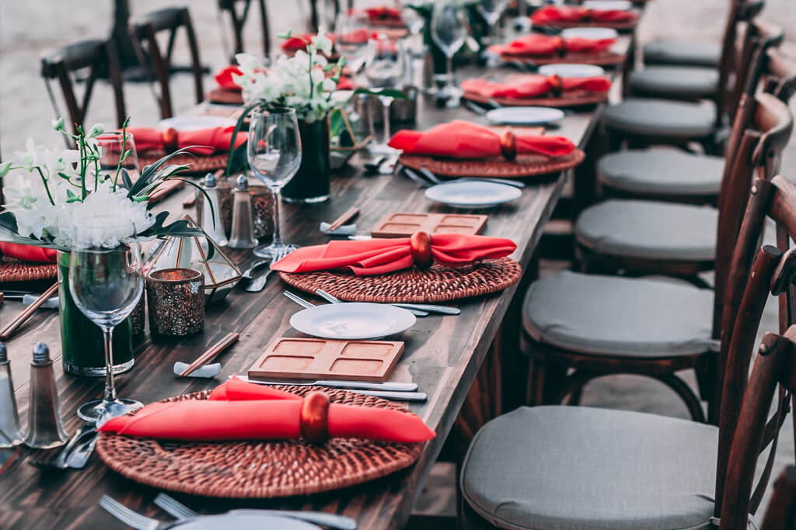</td>
  </tr>
</table>

<!-- ============================= CHEFS ============================== -->

<h3 align="center">👨‍🍳 Meet Our Chefs</h3>

<table align="center">
  <tr>
    <td align="center">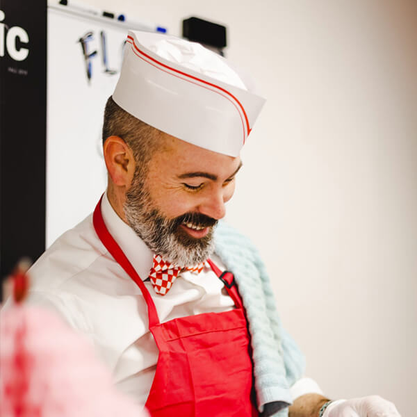<br><sub><b>Walter White</b><br>Master Chef</sub></td>
    <td align="center">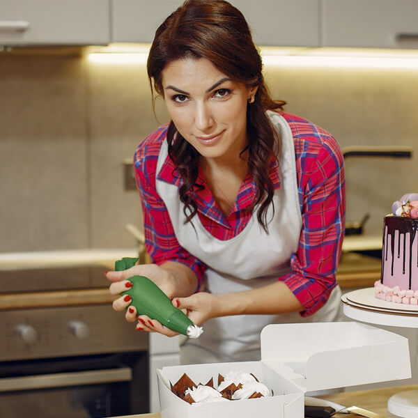<br><sub><b>Garima Arora</b><br>Patissier</sub></td>
    <td align="center"><br><sub><b>William Anderson</b><br>Cook</sub></td>
  </tr>
</table>

---

## 📖 Table of Contents

- [About the Project](#-about-the-project)
- [Features](#-features)
- [Tech Stack](#-tech-stack)
- [Project Structure](#-project-structure)
- [Getting Started](#-getting-started)
- [Database Setup](#-database-setup)
- [Usage](#-usage)
- [Screens & Pages](#-screens--pages)
- [Contributing](#-contributing)
- [License](#-license)
- [Contact](#-contact)

---

## 🥘 About the Project

**Foodie.com** is a modern, responsive restaurant website where visitors can explore a delicious menu, add dishes to a shopping cart, reserve a table, and complete a payment — all from within the browser. It combines a sleek, animated front-end with a PHP + MySQL back-end for authentication, table bookings, and contact messages.

The UI is fully responsive (mobile-first), supports a **dark mode** toggle, animated scroll reveals, a typing hero headline, tabbed menu categories, an auto-playing gallery slideshow, and a live shopping cart backed by `localStorage`.

---

## ✨ Features

- 🍔 **Tabbed Menu** — Breakfast, Lunch and Dinner categories with prices and "Add to Cart" buttons.
- 🛒 **Shopping Cart** — Powered by `localStorage`; increase/decrease quantity, remove items, and view a live order summary (`cart.html`).
- 💳 **Multi-method Checkout** — Pay via **UPI** (QR code + UPI ID), **Debit/Credit Card**, or **Cash on Delivery** (`payment.html`).
- 📅 **Book a Table** — Reservation form with client- and server-side validation (age ≥ 18, 10-digit phone, allowed email domains) saved to MySQL.
- 🔐 **User Authentication** — Sign-up & login with hashed passwords (`password_hash` / `password_verify`).
- 📧 **Contact Form** — Feedback/contact messages stored in the database.
- 🌙 **Dark Mode** — Theme preference remembered via `localStorage`.
- 🎞️ **Animations** — Typing hero text, scroll-reveal sections (IntersectionObserver), and a gallery slideshow.
- 📱 **Fully Responsive** — Bootstrap grid + custom media queries for all screen sizes.

---

## 🛠️ Tech Stack

| Layer | Technology |
|-------|------------|
| **Front-end** | HTML5, CSS3, Vanilla JavaScript |
| **UI Library** | Bootstrap 5, Font Awesome 6, RemixIcon |
| **Fonts** | Google Fonts (Material Symbols) |
| **Back-end** | PHP (MySQLi, prepared statements) |
| **Database** | MySQL / MariaDB |
| **Server** | Apache (XAMPP) |
| **Storage** | Browser `localStorage` (cart & theme) |

---

## 📁 Project Structure

```text
FoodieWebsite.github.io/
│
├── index.html            # Main landing page (hero, about, menu, chefs, booking, gallery, contact)
├── starterpage.html      # Welcome / splash landing page
├── login.html            # User login page
├── signup.html           # User registration page
├── cart.html             # Shopping cart & order summary
├── payment.html          # Checkout & payment methods
│
├── css/
│   ├── style.css         # Primary styles for the landing page & dark mode
│   └── index.css         # Styles for cart & payment pages
│
├── JS/
│   └── script.js         # Nav toggle, dark mode, typing effect, tabs, slideshow, cart logic
│
├── PHP/
│   ├── signup.php        # Registration handler (password hashing)
│   ├── login.php         # Login handler (password verification)
│   ├── book_table.php    # Table reservation handler
│   └── contact.php       # Contact/feedback handler
│
├── img/                  # All food, chef, gallery images, QR code & favicon
└── README.md
```

---

## 🚀 Getting Started

### Prerequisites

- [XAMPP](https://www.apachefriends.org/) (Apache + MySQL + PHP) — or any equivalent PHP/MySQL stack.
- A modern web browser.

### Installation

1. **Clone the repository** into your XAMPP `htdocs` folder:

   ```bash
   cd C:\xampp\htdocs
   git clone https://github.com/RitamNaskar11/FoodieWebsite.github.io.git
   ```

2. **Start Apache and MySQL** from the XAMPP Control Panel.

3. **Create the databases** (see [Database Setup](#-database-setup) below).

4. **Open the site** in your browser:

   ```
   http://localhost/FoodieWebsite.github.io/
   ```

---

## 🗄️ Database Setup

The back-end expects **three** MySQL databases. Open **phpMyAdmin** (`http://localhost/phpmyadmin`) and run the following SQL:

```sql
-- 1. Database used by signup.php & login.php
CREATE DATABASE IF NOT EXISTS user_auth;
USE user_auth;
CREATE TABLE users (
  id        INT AUTO_INCREMENT PRIMARY KEY,
  name      VARCHAR(100) NOT NULL,
  email     VARCHAR(150) NOT NULL UNIQUE,
  password  VARCHAR(255) NOT NULL
);

-- 2. Database used by book_table.php
CREATE DATABASE IF NOT EXISTS bookings;
USE bookings;
CREATE TABLE table_bookings (
  id      INT AUTO_INCREMENT PRIMARY KEY,
  name    VARCHAR(100),
  phone   VARCHAR(15),
  email   VARCHAR(150),
  date    DATE,
  time    TIME,
  city    VARCHAR(100),
  state   VARCHAR(100),
  message TEXT
);

-- 3. Database used by contact.php
CREATE DATABASE IF NOT EXISTS contact;
USE contact;
CREATE TABLE contact (
  id      INT AUTO_INCREMENT PRIMARY KEY,
  name    VARCHAR(100),
  email   VARCHAR(150),
  phone   VARCHAR(15),
  message TEXT
);
```

> **Note:** The PHP files connect with the default XAMPP credentials — host `localhost`, user `root`, empty password. Update the `new mysqli(...)` connection details in the `PHP/` files if your setup differs.

---

## 🧭 Usage

1. Open the site → `index.html` (or `starterpage.html`).
2. **Explore the menu** and click **Add to Cart** on any dish (the cart icon in the navbar shows the count).
3. Click the **cart icon** to review items, adjust quantities, and proceed to **checkout**.
4. Choose a payment method (**UPI / Card / Cash on Delivery**) and complete the order.
5. Use the **Book a Table** form to reserve a table, or the **Contact** form to send a message.
6. Toggle **🌙 dark mode** from the navbar — your preference is saved automatically.

---

## 🖥️ Screens & Pages

| Page | File | Purpose |
|------|------|---------|
| 🏠 Home / Landing | `index.html` | Hero, About, Menu, Chefs, Book Table, Gallery, Testimonials, Contact |
| 🚪 Splash | `starterpage.html` | Minimal welcome page linking to Login / Sign up |
| 🔑 Login | `login.html` | User login form |
| 📝 Sign Up | `signup.html` | User registration form |
| 🛒 Cart | `cart.html` | Cart items, quantities, order summary & delivery estimate |
| 💳 Payment | `payment.html` | Payment details, method selection & order summary |

---

## 🤝 Contributing

Contributions, issues and feature requests are welcome!

1. Fork the repository.
2. Create your feature branch: `git checkout -b feature/AmazingFeature`.
3. Commit your changes: `git commit -m "Add some AmazingFeature"`.
4. Push to the branch: `git push origin feature/AmazingFeature`.
5. Open a Pull Request.

---

## 📄 License

This project is released under the **MIT License**. You are free to use, modify and distribute it.

```
MIT License

Copyright (c) 2024 Foodie.com

Permission is hereby granted, free of charge, to any person obtaining a copy
of this software and associated documentation files (the "Software"), to deal
in the Software without restriction, including without limitation the rights
to use, copy, modify, merge, publish, distribute, sublicense, and/or sell
copies of the Software, and to permit persons to whom the Software is
furnished to do so, subject to the following conditions:

The above copyright notice and this permission notice shall be included in all
copies or substantial portions of the Software.

THE SOFTWARE IS PROVIDED "AS IS", WITHOUT WARRANTY OF ANY KIND, EXPRESS OR
IMPLIED, INCLUDING BUT NOT LIMITED TO THE WARRANTIES OF MERCHANTABILITY,
FITNESS FOR A PARTICULAR PURPOSE AND NONINFRINGEMENT. IN NO EVENT SHALL THE
AUTHORS OR COPYRIGHT HOLDERS BE LIABLE FOR ANY CLAIM, DAMAGES OR OTHER
LIABILITY, WHETHER IN AN ACTION OF CONTRACT, TORT OR OTHERWISE, ARISING FROM,
OUT OF OR IN CONNECTION WITH THE SOFTWARE OR THE USE OR OTHER DEALINGS IN THE
SOFTWARE.
```

---

## 📬 Contact

- **Repository:** [RitamNaskar11/FoodieWebsite.github.io](https://github.com/RitamNaskar11/FoodieWebsite.github.io)
- **Address:** Barrackpore – Barasat Road, Kolkata, West Bengal
- **Phone:** +91-7545647654
- **Email:** yummyme@gmail.com
- **Opening Hours:** Mon–Sat 11:00 – 23:00 · Sunday Closed

---

<p align="center">
  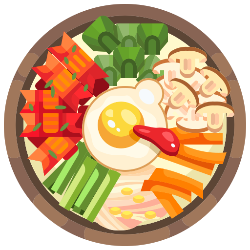<br>
  <b>🍴 Foodie.com — Enjoy healthy and delicious food!</b>
</p>

<p align="center"><i>Made with ❤️ and a lot of ☕.</i></p>